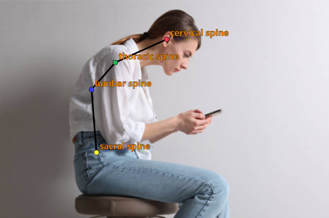
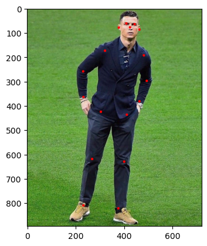
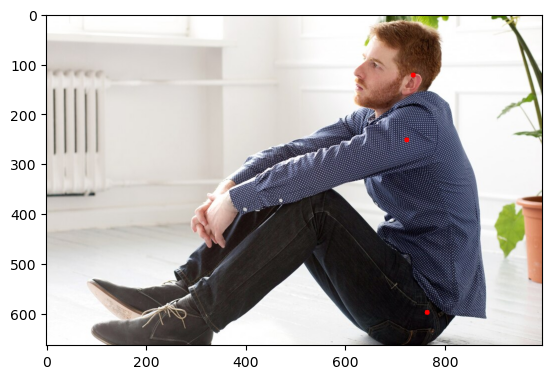
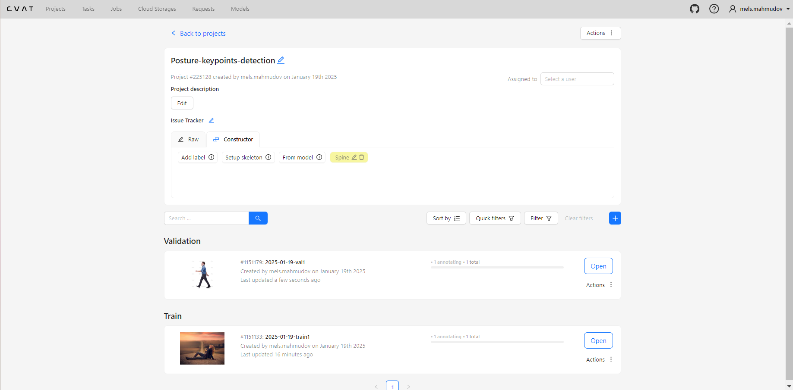
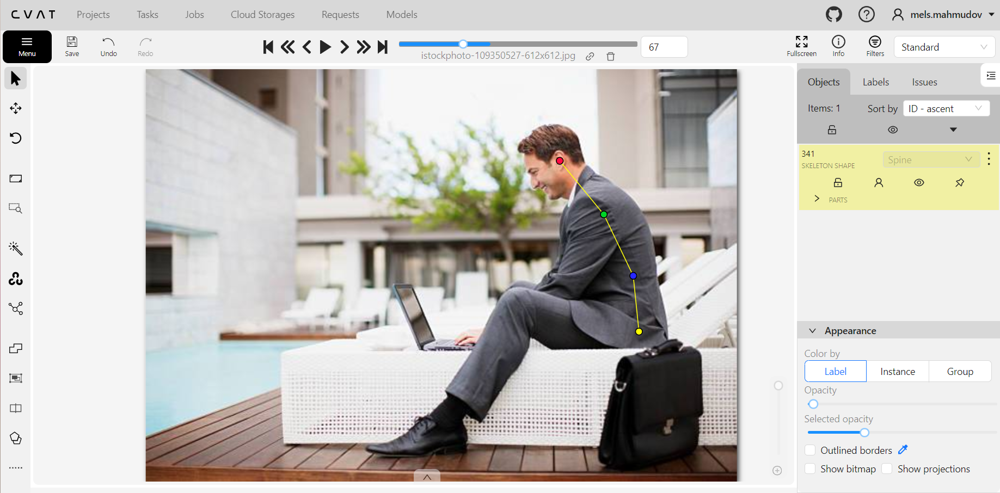
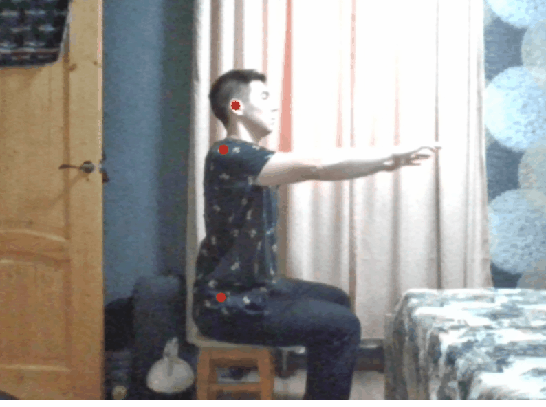
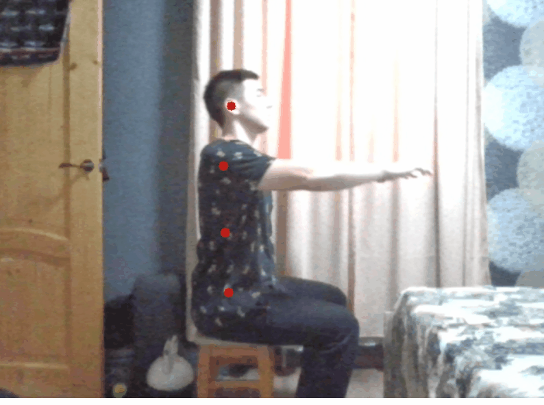

# Анализ осанки человека с помощью детектирования ключевых точек позвоночника
---
Это приложение было разработано в рамках **итогового проекта курса Deep Learning School от МФТИ**. Оно позволяет отслеживать положение спины человека в процессе его работы за компьютером.

Мы собрали и разметили датасет из 300 изображений людей и дообучили на нём модель YOLO11s-pose. Обученная модель позволяет детектировать ключевые точки позвоночника, которые в дальнейшем могут быть использованы для анализа и корректировки осанки человека.
Для демонстрации работы обученной модели было реализовано веб-приложение на фреймворке Streamlit. Приложение получает видеопоток с вебкамеры пользователя и с помощью модели детектирует ключевые точки осанки.

## Поиск проблемы и описание предполагаемого решения
---
### Проблема
Кривая осанка – одна из наиболее распространенных проблем среди людей, работающих за компьютером. Эта проблема может привести к серьезным последствиям для здоровья, включая боли в спине, шее и плечах, а также головные боли и проблемы со зрением. 

Основная причина кривой осанки при работе за компьютером заключается в неправильном положении тела. Когда человек сидит за столом, он часто наклоняется вперед, чтобы лучше видеть экран монитора или клавиатуру. Это приводит к напряжению мышц спины и шеи, что вызывает их усталость и деформацию позвоночника.
### Предполагаемое решение
Предполагаемое решение заключается в реализации программного обеспечения, которое бы с помощью установленной сбоку от человека камеры отслеживало положение спины и уведомляло пользователя при отклонении позвоночника от вертикального положения.

Для отслеживания положения спины необходимо определять ключевые точки позвоночника, по которым уже можно анализировать осанку человека. Чтобы обнаруживать ключевые точки можно обучить свою или найти уже готовую модель детекции.

Самый простой способ опредления правильности осанки по ключевым точкам - это определение расстояния между парами ключевых точек по координате X. Если расстояния между двумя точками превышает некоторое пороговое значение, то будем считать, что осанка кривая, в противном случае делаем вывод, что осанка ровная.

## Поиск обученной модели и датасета
---
### Модель YOLO11s-pose
YOLO11s-pose — это модель машинного обучения, предназначенная для определения позы человека (Pose Estimation). Она представляет собой одну из версий модели YOLO, ориентированную на задачи обнаружения объектов и оценки их позы в реальном времени. Число 11 в названии означает версию модели YOLO, а буква s - размер архитектуры модели.

В стандартной модели позы YOLO11 имеется 17 ключевых точек, каждая из которых представляет собой отдельную часть человеческого тела. Вот отображение каждого индекса на соответствующий сустав тела:
- 0: Нос
- 1: Левый глаз 
- 2: Правый глаз 
- 3: Левое ухо 
- 4: Правое ухо 
- 5: Левое плечо 
- 6: Правое плечо 
- 7: Левый локоть 
- 8: Правый локоть 
- 9: Левое запястье 
- 10: Правое запястье 
- 11: Левое бедро 
- 12: Правое бедро 
- 13: Левое колено 
- 14: Правое колено 
- 15: Левая лодыжка 
- 16: Правая лодыжка

Демонстрация работы модели YOLO:

Попробуем применить модель YOLO11s-pose для нашей задачи. После инференса модели отобразим только точки, которые находятся на линии позвоночника.

С детектированием точек модель справляется очень даже хорошо, однако для более точной оценки осанки необходимо также отслеживать промежуточную точку между точками в бедре и плече. На приведённом примере видно, что все три точки находятся примерно на одной линии, однако позвоночник находится в неровном положении из-за искривления в грудном и поясничном отделах. 

Таким образом, модель YOLO11s-pose из коробки не позволяет полноценно отслеживать положение спины человека.
### Сбор и разметка датасета
#### Сбор изображений
Учитывая перечисленный выше недостаток модели YOLO11s-pose, было принято решение осуществить fine tuning этой модели на новом датасете, который будет содержать изображения с разметкой всех необходимых точек.

Было собрано 300 изображений людей в положении сидя и стоя (камера расположена сбоку). Большая часть изображений была взята со следующих сайтов: https://ru.freepik.com/, https://www.istockphoto.com/ru.

На тренировочную выборку было выделено 250 изображений, а на валидационную оставшиеся 50.
#### Разметка в CVAT
Для разметки изображений использовался такой инструмент как CVAT. CVAT (Computer Vision Annotation Tool) — это веб-платформа для аннотирования изображений и видео с открытым исходным кодом. Используется для разметки данных под задачи компьютерного зрения.

Вот как выглядит проект в инструменте CVAT:

Процесс разметки:

Скачать датасет и прочитать его полное описание можно по ссылке https://www.kaggle.com/datasets/melsmm/posture-keypoints-detection/data.

## Обучение модели
---
После сбора и разметки датасета мы дообучили на нём модель YOLO11s-pose. При обучении мы задали количетсво эпох равное 200, а размер батча равным 32. Обучение заняло около 23-х минут на GPU P100.

По окончании обучения удалось достигнуть следующих показателей по метрикам:
| Class | Images | Instances | Box | P | R | mAP50 | mAP50-95 | Pose | P | R | mAP50 | mAP50-95 |
| ---- | ---- | ---- | ---- | ---- | ---- | ---- | ---- | ---- | ---- | ---- | ---- | ---- |
| all | 50 | 50 |  | 0.868 | 0.8 | 0.841 | 0.548 |  | 0.94 | 0.947 | 0.982 | 0.895 |

Код обучения содержится в записной книжке notebooks/train.ipynb.

## Тестирование модели
---
Приведём сравнение дообученной модели с базовой моделью YOLO11s-pose. Посмотрим как модели детектируют ключевые точки в реальном времени.

Результат работы базовой модели YOLO11s-pose:

Результат работы дообученной модели:

Можем отметить, что дообученная модель детектирует ключевые точки со схожим качеством, однако она обнаруживет ещё одну дополнительную ключевую точку, как мы и хотели.

В записной книжке notebooks/inference.ipynb содержится ещё несколько примеров инференса моделей на изображениях.

## Разработка демо
---
В качестве фреймворка для разработки веб-демо был выбран Streamlit, Streamlit — это бесплатный фреймворк для языка программирования Python с открытым исходным кодом, который позволяет создавать интерактивные панели и приложения на базе машинного обучения и делиться ими. Для написания Backend-части приложения использовался FastAPI, FastAPI — веб-фреймворк для создания API, написанный на Python. После чего мы обернули оба сервиса в docker-compose.

Приложение использует предобученную модель YOLO для определения ключевых точек тела и оценивает правильность осанки. Если осанка правильная, выводится сообщение "Отличная осанка" зеленым цветом, иначе — "Выпрями спину" красным. Также в отдельном окне выводится изображение с вебкамеры, на котором отмечены соединённые линиями ключевые точки. При этом, если осанка правильная, то точки рисуются зелёным цветом, иначе - красным.

Оценка правильности осанки осуществляется путём вычисления расстояния между парами ключевых точек по координате X. Если расстояния между двумя точками превышает некоторое пороговое значение, то будем считать, что осанка кривая, в противном случае делаем вывод, что осанка ровная.

Пороговое значение вычисляется по следующей формуле:

$$threshold = K * l,$$
где $$l$$ - это разница по модулю между координатами $$Y$$ крайних ключевых точек, $$K$$ - некоторый коэффициент правильности осанки.

Использование $$l$$ нужно для того, чтобы пороговое значение изменялось с изменением размера изображения. 

А $$K$$ регулирует степень допустимого отклонения спины от вертикального положения и варьируется в диапазоне $$(0, 1]$$. При этом чем меньше $$K$$, тем сильнее программа реагирует на небольшие отклонения в осанке. Экспериментальным путём было получено, что $$K = 1/6$$ является оптимальным значением
## Тестирование демо
---
Протестируем разработанное веб-приложение:

Проанлизировав приведённый выше пример, можно сделать вывод, что все ключевые точки детектируются с хорошей точностью и правильность осанки оценивается корректно.
